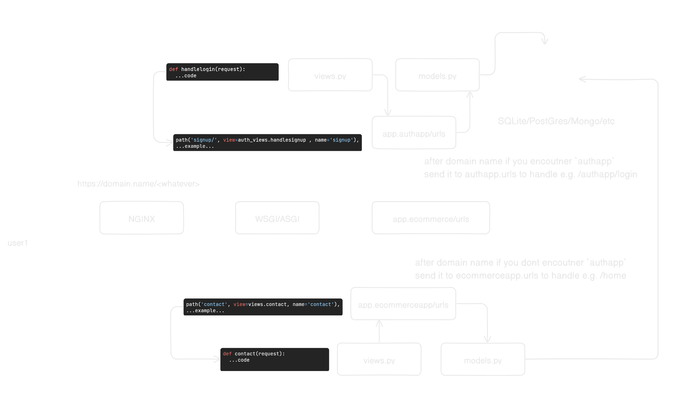

# Documentation

This file just generically explains the `ecommerce` app

To start a django project you can use the following command to init a django app

```bash
django-admin startproject <project_name> 
```

for example

```bash
django-admin startproject django_app 
```

Your project structure will look something like this

```bash
myproject/
├── manage.py
├── django_app/
    ├── __init__.py # the __init__ indicates the python that treat this folder as module
    ├── asgi.py
    ├── settings.py
    ├── urls.py
    └── wsgi.py
```

In Django there are apps which are like lego blocks which you can pick
from one django project and put then into another project and they would work
fine without any issues.

You can create new app using the following command

```bash
python ./manage.py startapp <app_name>
```

for example

```bash
python ./manage.py startapp authentication
```

```bash
myproject/
├── manage.py
├── django_app/
    ├── __init__.py
    ├── asgi.py
    ├── settings.py
    ├── urls.py
    └── wsgi.py
└── authentication/
    ├── __init__.py
    ├── admin.py
    ├── apps.py
    ├── migrations/
    |   └── __init__.py
    ├── models.py
    ├── tests.py
    └── views.py
```

this will create a new app but you need to tell the `main` django app that you can
then later on specify in `settings.py`.

Heres a really simple High-Overview of the project and django in general
